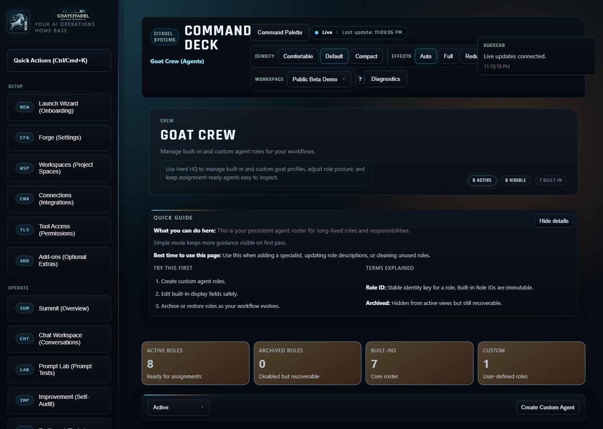
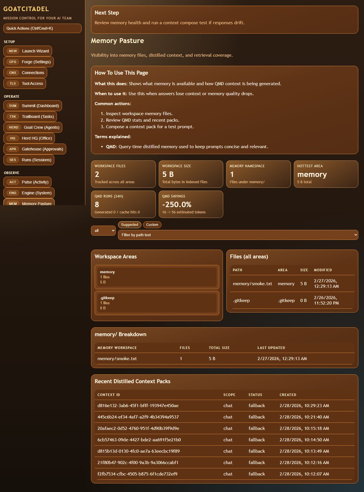
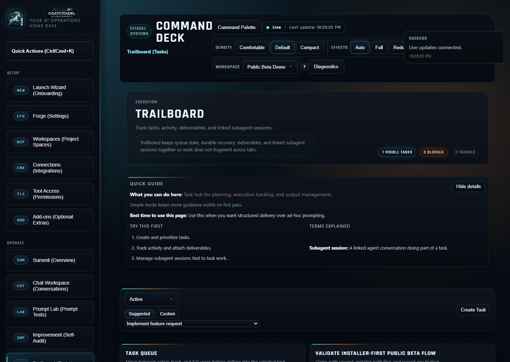
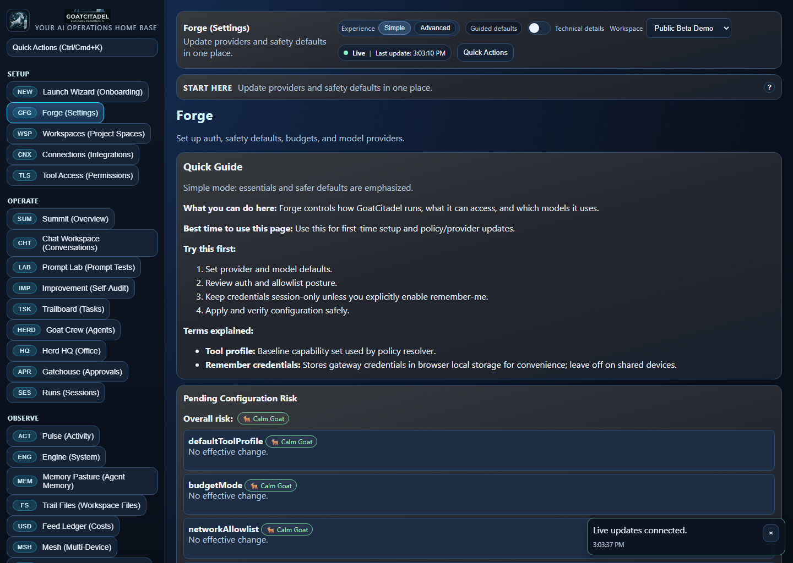

# GoatCitadel Mission Control

Local-first TypeScript platform for running and orchestrating personal AI agents with strict safety gates, deterministic session truth, and a goat-themed operator UI.

## Deep Documentation

For full engineering-level documentation (architecture, data model, API map, safety model, runbooks, known gaps, and review checklist), read:

- [`docs/ENGINEERING_HANDBOOK.md`](./docs/ENGINEERING_HANDBOOK.md)
- [`docs/INSTALL_SETUP_TESTING.md`](./docs/INSTALL_SETUP_TESTING.md)

## What GoatCitadel Includes

- Fastify gateway as source of truth for sessions, transcripts, token usage, and cost accounting.
- Tool policy engine with deny-wins enforcement, directory jailing, network allowlist, and HITL approval gates.
- Agent skills system using `SKILL.md` + YAML frontmatter with deterministic precedence.
- Mission Control UI with full API-first workflows and realtime event streaming.
- Office V4 WebGL scene with a central human operator (`GoatHerder`, renameable) and goat subagents around a live command floor.
- OpenAI-compatible provider routing using `/v1/chat/completions` (legacy `/v1/completions` intentionally not used).
- Bulletproof gateway dev hot reload supervisor (process-tree kill, port release checks, health-checked restart).
- Local execution with Git worktree support for orchestration isolation (no Docker).

## Screenshots

### Summit


### Herd HQ (WebGL)


### Goat Crew


### Memory Pasture


### Trailboard


### Gatehouse Queue


### Forge (Providers + Runtime Controls)


Local gallery page:
`docs/screenshots/mission-control/index.html`

## Runtime Architecture

- `apps/gateway`: API server (sessions, approvals, tools, costs, skills, orchestration APIs).
- `apps/mission-control`: React + Vite operator console.
- `packages/contracts`: shared API/domain types.
- `packages/storage`: SQLite repositories + append-only JSONL transcript/audit logs.
- `packages/gateway-core`: event ingest, deterministic session keys, token/cost ledger logic.
- `packages/policy-engine`: policy resolver and local sandbox gates.
- `packages/skills`: skills loader, precedence, activation resolution.
- `packages/orchestration`: plans/waves/phases runtime logic and checkpoints.

Data layout:

- SQLite index/cache: `data/index.db`
- Session transcripts: `data/transcripts/<sessionId>.jsonl`
- Audit streams: `data/audit/*.jsonl`

## Safety Model

- Mutating API requests require `Idempotency-Key`.
- Policy model: `tools.profile + tools.allow + tools.deny + per-agent overrides`.
- Deny always wins.
- Directory jail path-prefix enforcement for write/read safety.
- Network allowlist enforcement for outbound calls.
- Risky actions produce approval requests and halt execution until resolved.
- Approval explainer runs async and non-blocking for layman-readable context.

## OpenAI-Compatible Provider Support

GoatCitadel supports any provider exposing OpenAI-compatible endpoints.

Examples:

- OpenAI: `https://api.openai.com/v1`
- LM Studio: `http://127.0.0.1:1234/v1`
- Ollama-compatible bridges that implement OpenAI `chat/completions`

API style used by GoatCitadel:

- Supported: `/v1/chat/completions`
- Not used: `/v1/completions`

Configure providers in:

- `config/llm-providers.json`
- or the Mission Control `Forge` tab (`/api/v1/llm/config` under the hood)

## Installation

Default install home used by the installer/CLI:

- `~/.GoatCitadel` (override with `GOATCITADEL_HOME` or installer `--install-dir`)

### Prerequisites

- Node.js 22+
- Git
- Internet access to GitHub

### Quick Install (OpenClaw-style, GoatCitadel-branded)

Windows:

- PowerShell:
```powershell
iwr -useb https://raw.githubusercontent.com/spurnout/GoatCitadel/main/install.ps1 | iex
```

- CMD:
```cmd
curl -fsSL https://raw.githubusercontent.com/spurnout/GoatCitadel/main/install.cmd -o install.cmd && install.cmd && del install.cmd
```

Hackable (choose install method):
```bash
curl -fsSL https://raw.githubusercontent.com/spurnout/GoatCitadel/main/install.sh | bash -s -- --install-method git
```

macOS/Linux:

- One-liner:
```bash
curl -fsSL https://raw.githubusercontent.com/spurnout/GoatCitadel/main/install.sh | bash
```

### npm Global CLI Option (GitHub source)

```bash
npm i -g github:spurnout/GoatCitadel
```

Then:

```bash
goatcitadel onboard
```

### Local Dev Install (manual)

```bash
pnpm install
```

## Run Locally

Start both gateway + UI (recommended):

```bash
pnpm dev
```

Optional split mode:

```bash
pnpm dev:gateway
pnpm dev:ui
```

`pnpm dev:gateway` runs the gateway supervisor for reliable restart-on-change.
Direct watch-only mode is still available:

```bash
pnpm dev:gateway:watch
```

Start UI:

```bash
pnpm dev:ui
```

Open:

- UI: `http://localhost:5173`
- Gateway health: `http://127.0.0.1:8787/health`

If installed via installer/CLI:

```bash
goatcitadel onboard
goatcitadel up
```

## Key Config Files

Canonical unified config:

- `config/goatcitadel.json`

Derived split configs (auto-synced from `goatcitadel.json` at startup):

- `config/assistant.config.json`
- `config/tool-policy.json`
- `config/budgets.json`
- `config/llm-providers.json`
- `config/cron-jobs.json`
- `.env.example`

Manual sync command:

```bash
pnpm config:sync
```

## Mission Control Areas

- `Summit`: top-level KPIs and health.
- `Engine`: host/runtime vitals.
- `Trail Files`: workspace file browser/editor within jail roots.
  - Includes beginner artifact templates, path autopopulate, and save-risk review.
- `Memory Pasture`: memory and workspace area breakdown.
- `Goat Crew`: role roster and runtime overlays.
- `Herd HQ`: WebGL command floor (GoatHerder + goat subagents).
- `Pulse`: realtime events.
- `Bell Tower`: cron/scheduled routines.
- `Runs`: sessions, token totals, cost totals, health.
- `Playbook Skills`: loaded skills and dependencies.
- `Feed Ledger`: token and cost breakdowns with run-leaner hints.
- `Forge`: runtime policy and provider controls.
  - Includes page-wide change review and critical-change confirmation gates.
- `Gatehouse Queue`: approvals + replay + layman explanation status.
- `Trailboard`: task, subagent session, activity, and deliverable tracking.
  - Includes `Active/Trash/All` views plus soft delete, restore, and permanent delete.

## Core API Surface

Gateway/session:

- `POST /api/v1/gateway/events`
- `GET /api/v1/sessions`
- `POST /api/v1/tools/invoke`

Approvals:

- `POST /api/v1/approvals`
- `GET /api/v1/approvals`
- `POST /api/v1/approvals/:approvalId/resolve`
- `GET /api/v1/approvals/:approvalId/replay`

Costs:

- `GET /api/v1/costs/summary`
- `POST /api/v1/costs/run-cheaper`

LLM:

- `GET /api/v1/llm/providers`
- `GET /api/v1/llm/config`
- `PATCH /api/v1/llm/config`
- `GET /api/v1/llm/models`
- `POST /api/v1/llm/chat-completions`

Tasks/subagents:

- `GET/POST /api/v1/tasks`
- `PATCH/DELETE /api/v1/tasks/:taskId`
- `POST /api/v1/tasks/:taskId/restore`
- `GET/POST /api/v1/tasks/:taskId/activities`
- `GET/POST /api/v1/tasks/:taskId/deliverables`
- `GET/POST /api/v1/tasks/:taskId/subagents`
- `PATCH /api/v1/subagents/:agentSessionId`

Files:

- `GET /api/v1/files/templates`
- `POST /api/v1/files/templates/:templateId/create`

UX risk preflight:

- `POST /api/v1/ui/change-risk/evaluate`

Skills:

- `GET /api/v1/skills`
- `POST /api/v1/skills/reload`
- `POST /api/v1/skills/resolve-activation`

Orchestration:

- `POST /api/v1/orchestration/plans`
- `POST /api/v1/orchestration/plans/:planId/run`
- `POST /api/v1/orchestration/phases/:phaseId/approve`
- `GET /api/v1/orchestration/runs/:runId`

## Office V4 Customization

The center operator is configurable from `Herd HQ`:

- Default name: `GoatHerder`
- Renameable in the inspector
- Presets: `Trailblazer`, `Strategist`, `Nightwatch`
- Preferences persist in browser local storage

## Asset Policy (CC0)

Asset pipeline paths:

- `apps/mission-control/public/assets/office/models`
- `apps/mission-control/public/assets/office/textures`
- `apps/mission-control/public/assets/office/asset-manifest.json`

Tracking docs:

- `ASSET_LICENSES.md`
- `CREDITS.md`

Current default behavior uses procedural WebGL meshes, with optional CC0 model drop-ins.

## Validation Commands

```bash
pnpm -r typecheck
pnpm -r test
pnpm -r build
```

## Changelog

- [`CHANGELOG.md`](./CHANGELOG.md)

## Refresh Screenshot Pack

```bash
powershell -NoProfile -ExecutionPolicy Bypass -File scripts/capture-mission-control-screenshots.ps1
```

## Publish To GitHub (Initial Push)

```bash
git init
git add .
git commit -m "feat: GoatCitadel initial release"
git remote add origin https://github.com/spurnout/GoatCitadel.git
git branch -M main
git push -u origin main
```

## Notes

- This repository currently has no license file. Add one before public distribution.
- For legal certainty on naming and trademarks, do an official legal review before commercial launch.
