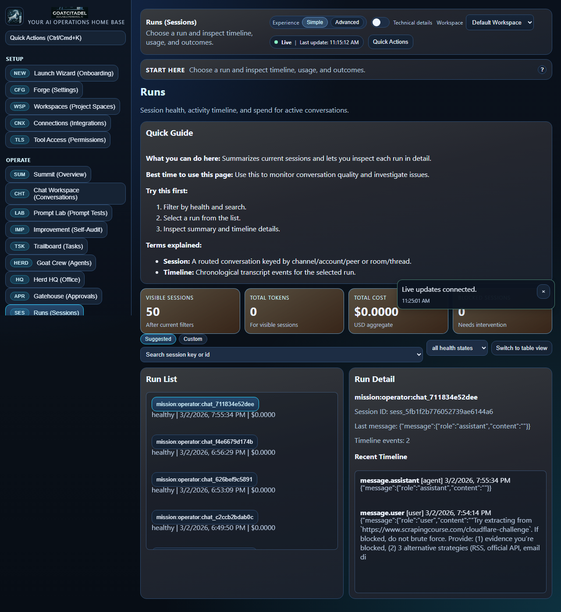
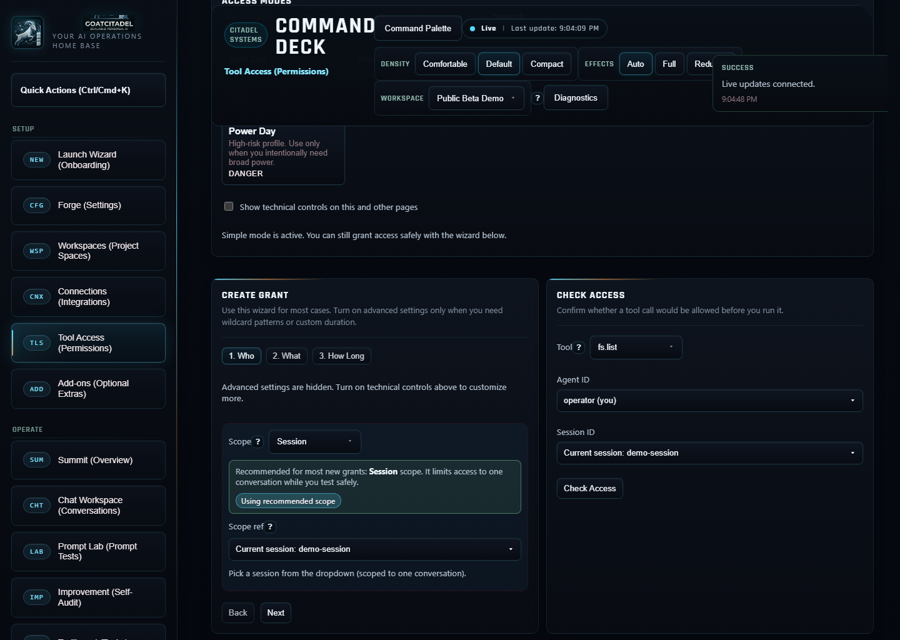

# 🐐 GoatCitadel

> [!WARNING]
> **Heavy development in progress.** GoatCitadel is moving fast and can be unstable between commits.
> Expect breaking changes, incomplete flows, and rough edges while core systems are being hardened.

GoatCitadel is a **local-first AI operations platform** for people who want more than a chatbot.
It combines agentic chat, policy enforcement, approval gates, audit trails, MCP expansion, and skills lifecycle controls in one operator-focused surface.

If you want ChatGPT-like speed with real operational controls, this project is built for that mission. ⚙️🐐

## Why GoatCitadel

- **Local-first by default**: your runtime, your data paths, your control plane.
- **Policy-first safety**: deny-wins access decisions, approval gates, and replayable audit history.
- **Agentic by design**: tool-aware orchestration with visible traces, citations, and fallback routing.
- **Built for operators**: clear status surfaces for sessions, tasks, costs, memory, approvals, and integrations.
- **Expandable**: MCP servers + skills with runtime posture (`enabled` / `sleep` / `disabled`).

## Product Snapshot

GoatCitadel gives you one Mission Control shell to:

- run chats in `Chat`, `Cowork`, and `Code` modes,
- route work through tools and governed approvals,
- personalize behavior with global + workspace guidance docs,
- benchmark behavior with Prompt Lab test packs,
- manage external capabilities (MCP, integrations, skills),
- monitor health, spend, and execution in real time.

## Hardening Snapshot (Current Branch)

- Prompt Lab now separates:
  - **Run failures**: execution/runtime issues (tooling, policy, transport).
  - **Score failures**: completed run quality below threshold.
- Prompt-pack reports now expose explicit gate counters:
  - `runFailureCount`, `scoreFailureCount`, `needsScoreCount`, `passThreshold`.
- Prompt Lab live updates run in **background refresh mode** after first load to avoid full-page skeleton flashes during `Run all`.
- Prompt Lab benchmark matrix APIs are available for model-vs-model subset runs.
- Mission Control UI now has:
  - global live/degraded freshness indicator,
  - reduced banner noise via consolidated notifications,
  - upgraded operator controls on high-traffic pages,
  - virtualized long lists on heavy activity/session/file/MCP surfaces.
- Gateway keeps a **warn-first** remote bind posture:
  - non-loopback + missing auth emits startup warnings with remediation guidance.
- Private-beta daily backup cron (`private_beta_backup_daily`) is enabled by default with retention pruning.
- Inbound channel/webhook-style route has tighter payload bounds and validation.
- Storage repositories continue migrating to safe JSON parsing to reduce malformed-row crash risk.

## Screenshot Preview 📸

### Summit + Operations


### Chat Workspace (Conversations)


### Prompt Lab (Prompt Tests)


### Runs and Session Views



### Tool Access + Governance



### Skills Runtime Controls


### Integrations + Connectivity


### MCP + Workspaces


> More screenshots are available in [`docs/screenshots/mission-control`](docs/screenshots/mission-control).

To refresh screenshots locally:

```bash
powershell -ExecutionPolicy Bypass -File scripts/capture-mission-control-screenshots.ps1
```

## Who This Is For

- Builders running serious AI workflows on a workstation, homelab node, or self-hosted stack.
- Teams that need **explainable automation** (what ran, why it ran, who approved it).
- Operators who want AI leverage **without surrendering control**.

## Who This Is Not For

- Plug-and-play SaaS users who want zero setup.
- Enterprise environments requiring mature multi-tenant RBAC/OIDC right now.
- Mobile-first product use-cases (web operator console is currently primary).

## Core Capabilities

### 🧠 Chat Workspace (Agentic)

- Modes: `Chat`, `Cowork`, `Code`
- Fast project/session switching
- Attachments + traces + citations
- Approval prompts for risky actions
- Slash commands + model/mode controls
- Workspace-aware guidance overlays (`global + workspace` docs)
- Constraints/workarounds surfaced when tools are blocked

### 🧪 Prompt Lab

- Import markdown packs with `[TEST-##]` blocks
- Run single, run next, or run all
- Hybrid scoring support (rule + model)
- Separate execution status from quality scoring (`run failure` vs `score failure`)
- Pass/fail visibility with remediation hints
- Benchmark matrix for subset model comparisons
- Exportable run reports for regression tracking

### 🛡️ Safety, Policy, and Approvals

- Deny-wins policy model
- Idempotency enforcement for mutating calls
- Approval queue + replay timeline
- Tool grants by scope (`task > agent > session > global`)
- Policy-gated MCP invocation path
- Non-loopback bind warnings when auth posture is weak

### 🔌 MCP + Skills Expansion

- Register local/remote MCP servers (`stdio`, `http`, `sse`)
- Server trust tiers and policy posture
- Skill lifecycle states: `enabled`, `sleep`, `disabled`
- Guarded-auto activation for sleep state
- Skill import pipeline: validate before install, provenance retained, high-risk confirmation
- Dual-source marketplace discovery (AgentSkill + SkillsMP) with equal priority merge
- Optional Obsidian vault integration (disabled by default, read/append-safe subpaths)

### 📊 Operator Observability

- Live activity stream
- Session and task diagnostics
- System and runtime vitals
- Cost visibility by day/session/agent/task
- Refresh health visibility (`Live`, `Degraded`, `Reconnecting`)
- Background refresh model to avoid full-page flicker during live operations

## Feature Matrix

| Area | Outcome |
|---|---|
| Chat Workspace | Agentic chat with execution trace visibility |
| Prompt Lab | Repeatable benchmark execution and quality scoring |
| Tool Access | Fine-grained grants and dry-run safety checks |
| MCP Servers | Controlled external capability expansion |
| Skills Playbook | Runtime activation governance and token-discipline |
| Gatehouse | Human-in-the-loop action approval |
| Feed Ledger | Spend awareness and budgeting feedback |
| Memory Pasture | Retrieval visibility and context quality diagnostics |

## Architecture (High Level)

- `apps/gateway`: Fastify API + orchestration runtime
- `apps/mission-control`: React + Vite operator UI
- `packages/contracts`: shared domain/API contract types
- `packages/storage`: SQLite repositories + transcript/audit persistence
- `packages/policy-engine`: policy resolution + guard rails
- `packages/skills`: skill loading, precedence, activation logic

Primary local data:

- SQLite: `data/index.db`
- Transcripts: `data/transcripts/<sessionId>.jsonl`
- Audit log stream: `data/audit/*.jsonl`

## Install (README = install-focused)

### Prerequisites

- Node.js `22+`
- `pnpm`
- Git

### 1) Clone

```bash
git clone https://github.com/<your-org-or-user>/goatcitadel.git
cd goatcitadel
```

### 2) Install dependencies

```bash
pnpm install
```

### 3) Sync runtime config files

```bash
pnpm config:sync
```

Private-beta profile artifacts:

- Env template: [`.env.private-beta.example`](.env.private-beta.example)
- Config snapshot: [`config/private-beta.profile.json`](config/private-beta.profile.json)

### 4) Verify baseline build health

```bash
pnpm -r typecheck
pnpm smoke
pnpm -r build
```

### 5) Run doctor diagnostics (safe auto-repair defaults)

```bash
goatcitadel doctor
```

Useful doctor flags:

- `--audit-only` or `--no-repair`: diagnostics only, no file changes.
- `--deep`: include runtime/onboarding API checks when gateway is reachable.
- `--yes`: auto-approve guarded repair prompts.
- `--json`: machine-readable report output.

> Runtime/start commands are intentionally kept in the install/testing guide so README stays install-focused:
> [`docs/INSTALL_SETUP_TESTING.md`](docs/INSTALL_SETUP_TESTING.md)

## Starter Docs

- Beginner prompt guide: [`docs/GoatCitadel_Prompt_Library.md`](docs/GoatCitadel_Prompt_Library.md)
- Optional Obsidian integration: [`docs/OBSIDIAN_OPTIONAL_INTEGRATION.md`](docs/OBSIDIAN_OPTIONAL_INTEGRATION.md)
- Skill import trust policy: [`docs/SKILL_IMPORT_AND_TRUST_POLICY.md`](docs/SKILL_IMPORT_AND_TRUST_POLICY.md)
- Agentic feature gap matrix: [`docs/AGENTIC_FEATURE_GAP_MATRIX.md`](docs/AGENTIC_FEATURE_GAP_MATRIX.md)

## Security Model At A Glance

- Mutating operations require `Idempotency-Key`
- Deny-wins tool policy semantics
- Approval gates for higher-risk actions
- Redaction/trust posture controls for MCP execution
- Secret references preferred over plaintext config storage

## Mission Control Modules

- `Launch Wizard`: first-time setup and baseline hardening
- `Summit`: at-a-glance operational overview
- `Chat Workspace`: day-to-day agentic conversation surface
- `Prompt Lab`: benchmark runner + scoring loop
- `Tool Access`: grants, dry-run checks, and policy posture
- `Playbook`: skills runtime state controls
- `MCP Servers`: server registration, trust tiers, policy routing
- `Gatehouse`: approvals queue + replay
- `Trailboard`: tasks, subagents, and deliverables

## API Highlights

### Chat

- `POST /api/v1/chat/sessions/:sessionId/agent-send`
- `POST /api/v1/chat/sessions/:sessionId/agent-send/stream`

### Skills

- `GET /api/v1/skills`
- `PATCH /api/v1/skills/:skillId/state`
- `POST /api/v1/skills/bulk-state`
- `GET /api/v1/skills/activation-policies`
- `PATCH /api/v1/skills/activation-policies`
- `GET /api/v1/skills/sources`
- `POST /api/v1/skills/import/validate`
- `POST /api/v1/skills/import/install`
- `GET /api/v1/skills/import/history`

### Optional Obsidian Integration

- `GET /api/v1/integrations/obsidian/status`
- `PATCH /api/v1/integrations/obsidian/config`
- `POST /api/v1/integrations/obsidian/test`
- `POST /api/v1/integrations/obsidian/search`
- `GET /api/v1/integrations/obsidian/note?path=...`
- `POST /api/v1/integrations/obsidian/append`
- `POST /api/v1/integrations/obsidian/inbox/capture`

### MCP

- `GET /api/v1/mcp/servers`
- `POST /api/v1/mcp/servers`
- `PATCH /api/v1/mcp/servers/:serverId`
- `PATCH /api/v1/mcp/servers/:serverId/policy`
- `POST /api/v1/mcp/invoke`

### Prompt Lab

- `POST /api/v1/prompt-packs/import`
- `POST /api/v1/prompt-packs/:packId/tests/:testId/run`
- `POST /api/v1/prompt-packs/:packId/tests/:testId/score`
- `GET /api/v1/prompt-packs/:packId/report`
- `POST /api/v1/prompt-packs/:packId/benchmark/run`
- `GET /api/v1/prompt-packs/benchmark/:benchmarkRunId`

### Workspaces + Guidance

- `GET /api/v1/workspaces`
- `POST /api/v1/workspaces`
- `GET /api/v1/workspaces/:workspaceId`
- `PATCH /api/v1/workspaces/:workspaceId`
- `POST /api/v1/workspaces/:workspaceId/archive`
- `POST /api/v1/workspaces/:workspaceId/restore`
- `GET /api/v1/guidance/global`
- `PUT /api/v1/guidance/global/:docType`
- `GET /api/v1/workspaces/:workspaceId/guidance`
- `PUT /api/v1/workspaces/:workspaceId/guidance/:docType`

Benchmark request body:

```json
{
  "testCodes": ["TEST-03", "TEST-06", "TEST-10", "TEST-12", "TEST-15", "TEST-28"],
  "providers": [
    { "providerId": "glm", "model": "glm-5" },
    { "providerId": "moonshot", "model": "kimi-k2.5" }
  ]
}
```

## Documentation

- Engineering handbook: [`docs/ENGINEERING_HANDBOOK.md`](docs/ENGINEERING_HANDBOOK.md)
- Install + setup + testing: [`docs/INSTALL_SETUP_TESTING.md`](docs/INSTALL_SETUP_TESTING.md)
- MCP + skills curation notes: [`docs/MCP_SKILLS_CURATION.md`](docs/MCP_SKILLS_CURATION.md)
- Optional Obsidian integration: [`docs/OBSIDIAN_OPTIONAL_INTEGRATION.md`](docs/OBSIDIAN_OPTIONAL_INTEGRATION.md)
- Skill import + trust policy: [`docs/SKILL_IMPORT_AND_TRUST_POLICY.md`](docs/SKILL_IMPORT_AND_TRUST_POLICY.md)
- Claude production review prompt: [`docs/CLAUDE_PROD_REVIEW_PROMPT.md`](docs/CLAUDE_PROD_REVIEW_PROMPT.md)
- Runtime guidance: [`GOATCITADEL.md`](GOATCITADEL.md)
- Agent conventions: [`AGENTS.md`](AGENTS.md)
- Claude workflow guidance: [`CLAUDE.md`](CLAUDE.md)
- Contributor workflow: [`CONTRIBUTING.md`](CONTRIBUTING.md)
- Security policy: [`SECURITY.md`](SECURITY.md)
- Product vision: [`VISION.md`](VISION.md)
- AI learning log (validated improvements): [`GOATCITADEL_LEARNING_LOG.md`](GOATCITADEL_LEARNING_LOG.md)

## Roadmap Signal

Near-term focus:

- Web extraction reliability and visual fallback hardening
- MCP runtime depth and safer server policy defaults
- Voice/multimodal reliability improvements
- Continued UI clarity and operator workflow polish

## Local-First Promise

GoatCitadel is being built so you can run high-leverage AI workflows on your own hardware and infrastructure, with explicit control over what runs, what gets approved, and where data goes. 🐐
