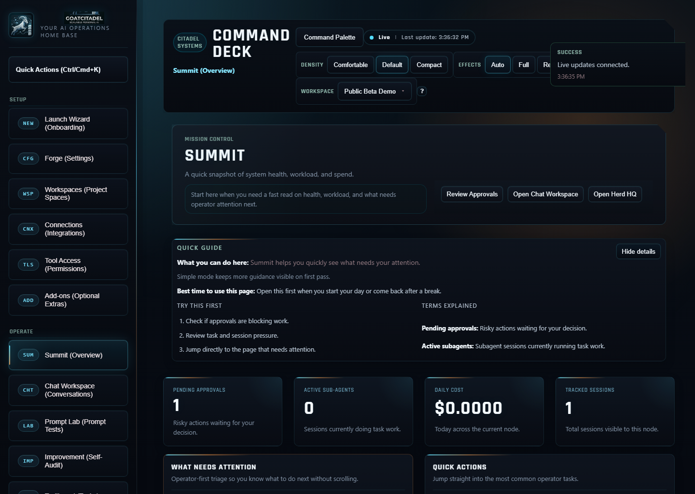
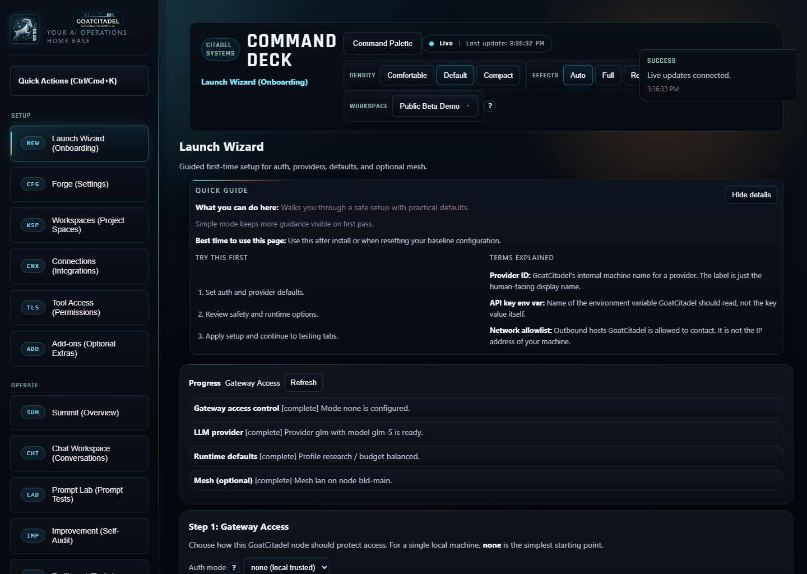
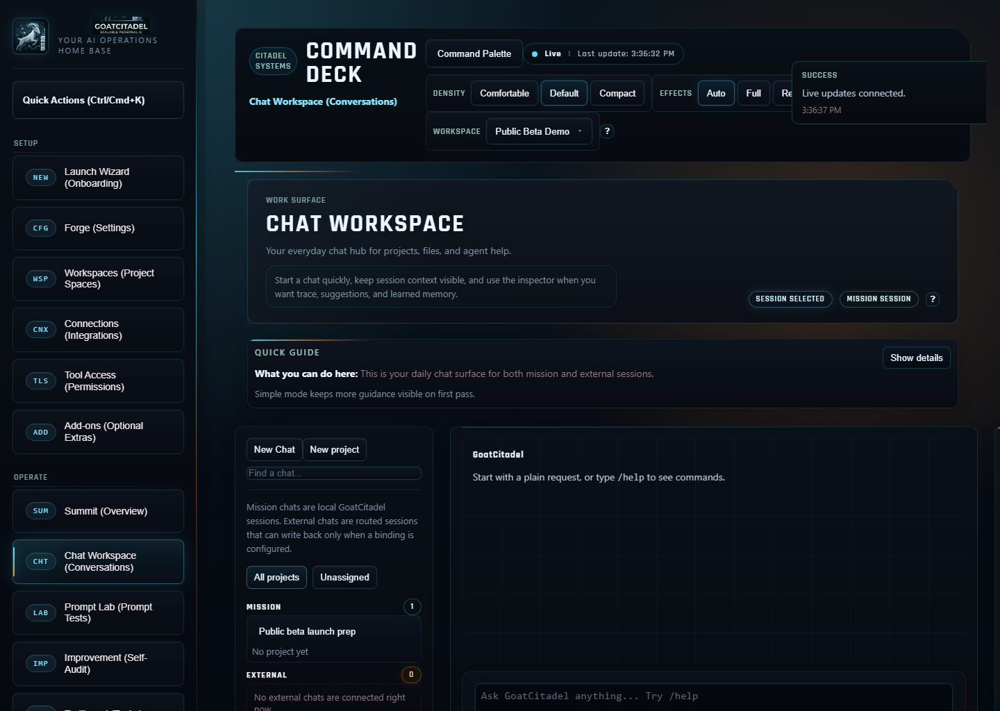
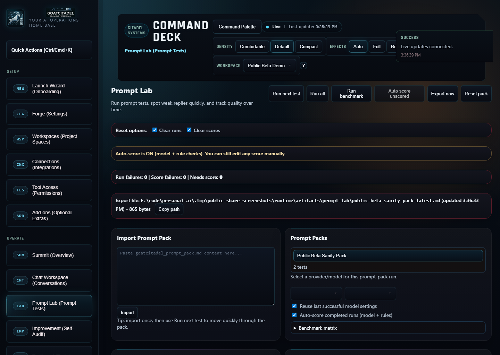
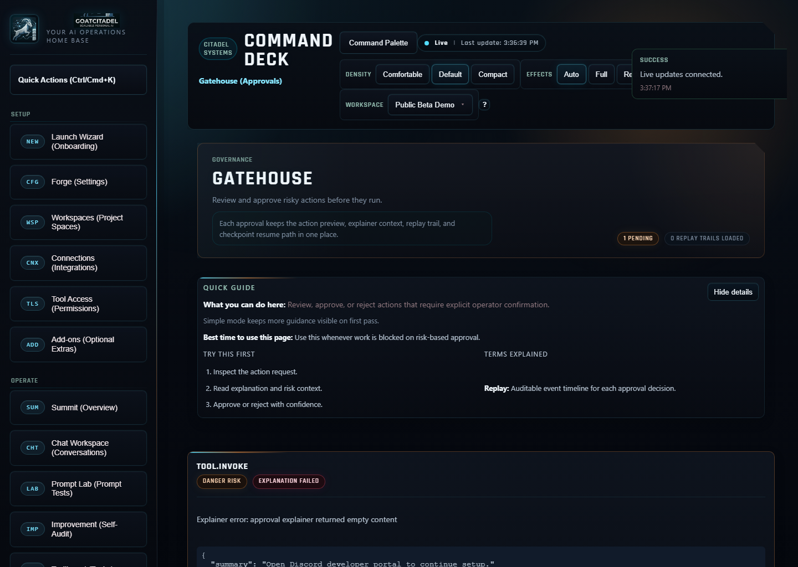
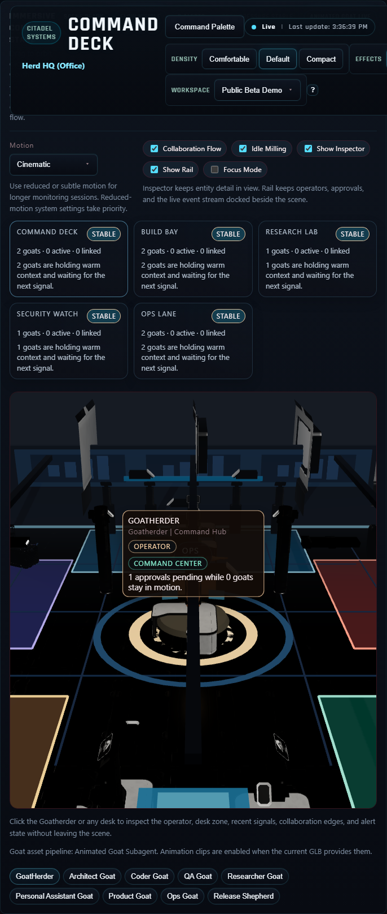
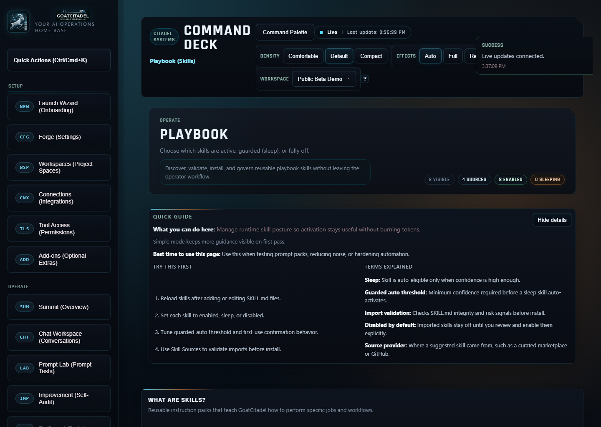
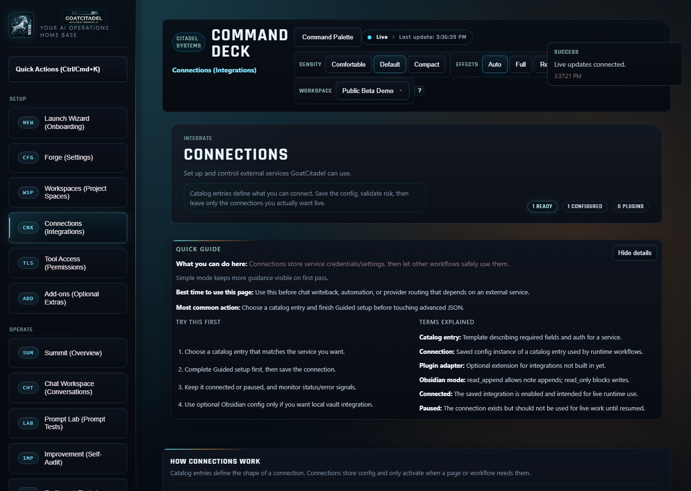
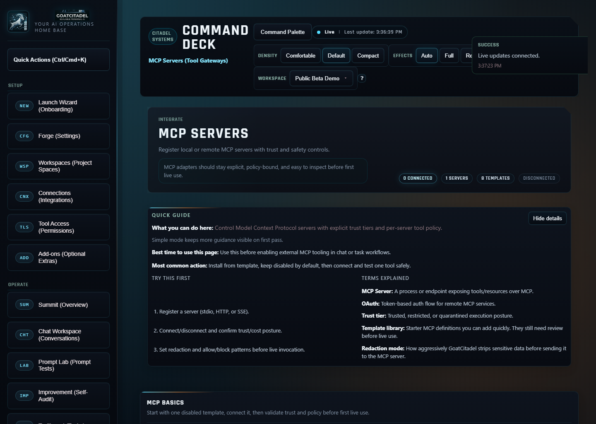
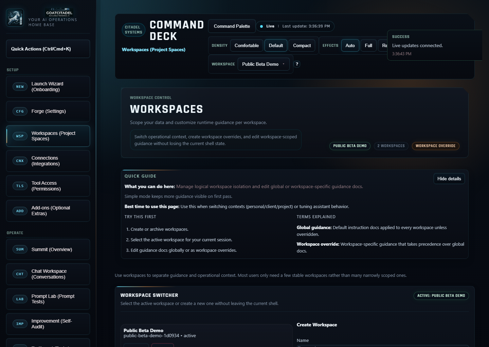

# GoatCitadel

> [!IMPORTANT]
> GoatCitadel is in public beta. The installer path, Mission Control surface, and core validation gates are ready for external testing, but the product is still evolving quickly toward 1.0.

Current release line: `0.6.0-beta.2`

GoatCitadel is a local-first AI operations platform for people who want more than a chat box. It gives you an operator-grade command deck for running, inspecting, approving, testing, and extending AI workflows across web, terminal, tools, and external systems without hiding the runtime from you.



## Why GoatCitadel

Most AI products optimize for "send prompt, receive answer." GoatCitadel optimizes for operating real AI systems:

- **Operator-first, not chat-box-first.** Mission Control, approvals, traces, sessions, cost visibility, and system health are part of the main product.
- **Local-first by default.** Your runtime, data paths, guardrails, and optional local model paths stay explicit.
- **Inspectable and interruptible.** You can review traces, check event flow, inspect sessions, and stop treating AI behavior like a black box.
- **Built for guarded automation.** Policy, approvals, tool grants, and deny-wins behavior are first-class instead of bolted on later.
- **Expandable without pretending trust does not matter.** MCP, Skills, integrations, add-ons, and optional local runtimes are surfaced with trust posture and review boundaries.

## What You Can Do With It

GoatCitadel is designed for the whole operating loop, not just prompting:

- run everyday conversations, research, cowork, and coding flows from one chat workspace
- keep humans in the loop with Gatehouse approvals before risky actions run
- observe live system behavior through Summit, Pulse, Sessions, System, Costs, and Herd HQ
- test prompts, compare providers, and track quality drift in Prompt Lab
- organize work by projects, workspaces, files, memory, tasks, and guidance
- connect tools and external systems through MCP, Skills, integrations, and optional add-ons
- run local voice transcription, local model backends, and multi-device mesh workflows when needed

## At A Glance

| Surface | Purpose | Why it matters |
| --- | --- | --- |
| **Command Deck / Summit** | High-level operational overview | Fast triage of approvals, sessions, work queues, and runtime state |
| **Chat Workspace** | Daily conversation surface | Unified chat, cowork, code, files, projects, orchestration, and tool-aware traces |
| **Gatehouse** | Human approval queue | Keep risky actions reviewable before they execute |
| **Herd HQ** | Live office-style observability | Visual awareness of active goats, zones, flow, and event pace |
| **Prompt Lab** | Prompt and model testing | Catch weak replies, regressions, and score drift before daily use |
| **Runs / Pulse / System / Costs** | Runtime inspection | See what happened, what is happening, and what it costs |
| **Skills / MCP / Integrations / Add-ons** | Extensibility layer | Expand the stack without pretending every extension should be trusted by default |

## Mode Behavior

| Mode | Default feel | Best for | What makes it different |
| --- | --- | --- | --- |
| **Chat** | Simple and low-friction | Everyday questions, quick research, task framing | Hidden or summarized orchestration, clean conversation flow |
| **Cowork** | Explicitly collaborative | Planning, delegation, subtasking, review loops | More visible orchestration and agent teamwork |
| **Code** | Specialized for software work | Repo inspection, patch planning, implementation, review, QA | Coding-specific orchestration patterns instead of generic multi-agent noise |

## Mission Control Surface Tour

### Command Deck / Summit

Summit is the operational front door:

- live system posture for approvals, tasks, sessions, health, and activity
- fast navigation into the surfaces that need attention next
- a top-level command-deck shell that stays useful even when the app grows

### Chat Workspace

Chat Workspace is the everyday control surface for real AI work:

- mission sessions and external sessions in one place
- `Chat`, `Cowork`, and `Code` modes with different behavior and orchestration posture
- file attachments, session organization, project binding, writeback binding, and learned memory
- tool-aware traces, approval prompts, delegation suggestions, and orchestration summaries
- markdown rendering, branch-aware turns, and richer run details for long-lived threads

### Gatehouse

Gatehouse is where risky actions stop being invisible:

- approval-first posture for tools and other guarded actions
- review context before you approve or deny
- replay and checkpoint context where available
- clean separation between safe automation and operator consent

### Herd HQ

Herd HQ is GoatCitadel's visual operations room:

- live floor view of the Goatherder and active goat stations
- office zones for command, build, research, security, and operations
- collaboration overlays, alert states, and event pace visible at a glance
- inspector and dock views that let you move between atmosphere and concrete detail

### Prompt Lab

Prompt Lab is where you stop guessing:

- import prompt packs from markdown
- run one test, next test, or batch runs
- compare providers and models on the same prompt surface
- separate execution failures from quality failures
- track scores, regressions, and weak answers before shipping changes

### The Rest Of The Deck

Mission Control also includes the surrounding surfaces that make GoatCitadel feel complete:

- **Trailboard** for tasks, deliverables, and subagent session linkage
- **Runs** for session inspection and spend visibility
- **Pulse** for live event streams
- **System** for daemon and runtime health
- **Forge** for auth, providers, budgets, voice runtime, mesh, and defaults
- **Files**, **Memory**, **Costs**, **Integrations**, **MCP Servers**, **Playbook**, **Workspaces**, and more

## Core Capabilities

### Operator-First Chat, Cowork, and Code

GoatCitadel is not just "chat with tabs":

- run daily assistant interactions in normal chat mode
- switch to **Cowork** for deeper delegation, review loops, and explicit collaboration
- switch to **Code** for repo-aware implementation, review, QA, and validation flows
- keep one shared backend intelligence layer while changing the policy and visibility by mode
- use advanced session controls instead of reconfiguring the whole app for every thread

### Traces, Reviews, and Runtime Visibility

GoatCitadel keeps the runtime visible:

- tool traces, run summaries, and per-turn execution details
- live event stream and session health views
- surfaced fallback, review, delegation, and orchestration behavior where it matters
- explicit insight into what happened instead of "trust the assistant"

### Guardrails, Policy, and Approvals

Safety is part of the product loop:

- deny-wins policy resolution
- scoped tool grants and approval posture
- path and network boundaries
- human-in-the-loop approval workflow for risky actions
- explicit break-glass env vars when you intentionally want a weaker safety posture

### Workspaces, Guidance, Memory, and Files

GoatCitadel supports longer-lived operational context:

- workspaces for project and context separation
- global guidance and workspace overrides
- memory surfaces for reusable knowledge and lifecycle inspection
- local file workflows and path-aware interaction surfaces
- project/session grouping so the product scales beyond throwaway threads

### Prompt Lab and Quality Management

Prompt quality is a first-class concern:

- curated prompt packs
- scoring and pass/fail thresholds
- regression visibility
- provider/model comparison
- separate quality review from raw runtime completion

### Multi-Provider and Mode-Aware Intelligence

GoatCitadel includes orchestration foundations that go beyond "one model for everything":

- multi-provider routing foundations across `Chat`, `Cowork`, and `Code`
- role-aware and mode-aware behavior
- summarized orchestration in simple chat flows
- more explicit orchestration in Cowork
- coding-specific orchestration patterns in Code rather than generic swarm behavior

### Skills, MCP, Integrations, and Add-Ons

GoatCitadel expands outward without hiding trust boundaries:

- **Playbook / Skills** for reusable skills with enabled, sleep, or disabled posture
- **MCP Servers** for local or remote tool gateways with trust tiers and redaction policy
- **Integrations** for external services and channels
- **Add-ons** for optional separate-repo extras like Arena
- discovery surfaces for MCP and skills sources with review-before-install posture

### Local Voice Runtime

Voice is local-first too:

- managed local whisper.cpp runtime is installed by default unless you opt out
- model catalog and selection live in the product instead of requiring raw repo hacks
- models live under `~/.GoatCitadel/tools/voice/`, not in the repository
- browser-recorded audio formats are normalized locally before transcription

### Mesh and Multi-Device Operation

GoatCitadel is not limited to one machine forever:

- mesh support for multi-node status and coordination
- node identity and session ownership visibility
- LAN and tailnet-oriented posture depending on your setup
- explicit control instead of pretending distributed behavior is "magic"

### Optional Local And External Model Providers

The provider layer is intentionally extensible:

- remote providers like OpenAI, Anthropic, Z.AI, Moonshot, and others
- optional local-model paths such as LM Studio and Ollama
- local NPU sidecar support when you want acceleration or sidecar-backed inference
- provider configuration stays explicit in Forge and onboarding

## Screenshots

Mission Control is a full operator surface, not a single-pane chat demo. The gallery below is curated for the README; the full screenshot set stays in [docs/screenshots/mission-control](docs/screenshots/mission-control).

### First Launch And Orientation

| Onboarding | Command Deck |
| --- | --- |
|  |  |

### Run The Work

| Chat Workspace | Prompt Lab |
| --- | --- |
|  |  |

### Keep Humans In The Loop

| Gatehouse | Herd HQ |
| --- | --- |
|  |  |

### Expand The Stack

| Skills | Integrations |
| --- | --- |
|  |  |

### Wire The Platform

| MCP Servers | Workspaces |
| --- | --- |
|  |  |

Additional current views in the full gallery include Agents, Sessions, Activity, Costs, Files, Memory, Settings, System, Mesh, and NPU Runtime.

## Install

Default installer location is your home directory under `~/.GoatCitadel`, with launchers in `~/.GoatCitadel/bin`.

### Windows

Safer download-and-run flow:

```powershell
iwr https://raw.githubusercontent.com/spurnout/GoatCitadel/main/install.ps1 -OutFile install.ps1
powershell -ExecutionPolicy Bypass -File .\install.ps1
```

Power-user one-liner:

```powershell
iwr -useb https://raw.githubusercontent.com/spurnout/GoatCitadel/main/install.ps1 | iex
```

Optional custom install root:

```powershell
powershell -ExecutionPolicy Bypass -File .\install.ps1 -InstallDir "$HOME\\.GoatCitadel"
```

Skip the managed local voice runtime during install:

```powershell
powershell -ExecutionPolicy Bypass -File .\install.ps1 -SkipVoice
```

### macOS / Linux

Safer download-and-run flow:

```bash
curl -fsSL https://raw.githubusercontent.com/spurnout/GoatCitadel/main/install.sh -o install.sh
bash install.sh
```

Power-user one-liner:

```bash
curl -fsSL https://raw.githubusercontent.com/spurnout/GoatCitadel/main/install.sh | bash
```

Optional custom install root:

```bash
bash install.sh --install-dir "$HOME/.GoatCitadel"
```

Choose a different starter voice model:

```bash
bash install.sh --voice-model small.en
```

### Verify The Installed Launcher

```bash
goatcitadel up
goatcitadel onboard
goatcitadel doctor --deep
```

Short alias:

```bash
goat up
goat onboard
goat doctor --deep
```

PowerShell notes:

- use `goatcitadel` or `goat`
- onboarding uses the live gateway API, so start with `goat up`
- do not use `gc` in PowerShell because it maps to `Get-Content`
- if `goatcitadel` is not found immediately after install, open a new PowerShell window

## Update

```bash
goatcitadel update
```

## Manual / Developer Install

Use this path if you want a raw clone, a contributor workflow, or a clean install-from-source validation:

```bash
git clone https://github.com/spurnout/GoatCitadel.git
cd GoatCitadel
corepack enable
corepack prepare pnpm@10.31.0 --activate
pnpm install --frozen-lockfile
pnpm config:sync
```

The default code clone keeps the shipped Office runtime assets in-repo, but the full Office source provenance bundle is published separately. See [docs/office-source-manifest.json](docs/office-source-manifest.json) and the related release bundle if you need to reproduce or edit the original Office source kits.

If you want browser research or automation from a raw source clone, install Playwright Chromium once:

```bash
pnpm --filter @goatcitadel/policy-engine exec playwright install chromium
```

### Verify The Repo Build

```bash
pnpm typecheck
pnpm test
pnpm smoke
pnpm build
pnpm docs:check
pnpm coverage:collect
pnpm coverage:gate
```

### First Run From A Clone

```bash
pnpm dev
pnpm onboarding:tui
pnpm doctor -- --deep
```

## Optional Ecosystem

GoatCitadel is designed to stay useful on its own and grow outward when you want more reach.

### MCP Servers

Use MCP when you want explicit tool gateways instead of one-off glue:

- connect local or remote MCP servers
- keep trust tiers, redaction posture, and review boundaries visible
- add template-backed servers without pretending every connector is equally safe
- keep external capability expansion inspectable from Mission Control

### Skills

Skills turn repeated workflows into reusable operator tools:

- bundled skills ship with the product
- workspace skills let you tune behavior to a specific project or domain
- enabled, sleep, and disabled states let you keep the surface available without always firing it
- good fits include coding workflows, automation design, review checklists, and domain-specific operator playbooks

### Integrations

GoatCitadel can connect to the systems around your work:

- communication channels and external services
- connector diagnostics and runtime visibility
- explicit status instead of hidden background assumptions

### Add-ons

Add-ons are optional separate-repo extras, not hidden core dependencies:

- install, start, stop, update, and remove them from Mission Control
- keep trust posture explicit
- launch supported extras externally instead of pretending everything belongs inside one shell
- current example: **Arena**, an optional AI gladiator sidecar app with its own local surface

### Local Voice Runtime

Voice is now a managed part of the product:

- installer-managed local whisper.cpp runtime
- downloadable model catalog instead of repo-committed models
- local audio normalization before transcription
- managed from Settings or the launcher, not by hand-editing prompt hacks

### Mesh And Multi-Device

GoatCitadel can extend beyond one machine when you need it:

- node identity and mesh posture are visible
- LAN and tailnet-oriented setups are supported
- multi-device operation stays explicit and operator-controlled

### Local And Remote Models

The provider layer supports both hosted and local paths:

- remote providers for high-capability general use
- optional local runtimes when privacy, latency, or cost posture matters
- provider configuration, budgets, and defaults remain visible in Forge

## Security And Guardrails

GoatCitadel is built for real operator control, not just convenience.

- **Deny wins.** Policy boundaries are authoritative.
- **Approvals stay first-class.** Risky actions can stop in Gatehouse before they execute.
- **Tool access is scoped.** Grants, trust, and path/network posture are explicit.
- **Visibility beats magic.** Traces, reviews, and runtime state are part of normal use.
- **Extensions are not silently trusted.** Skills, MCP servers, integrations, and add-ons are surfaced with trust posture instead of being treated as invisible background plumbing.

> [!NOTE]
> GoatCitadel is local-first, but local-first does not mean consequence-free. Review your provider settings, tool grants, approval posture, and extension trust before using it on work you actually care about.

## Documentation

Start here for deeper detail:

- [Install, setup, and testing](docs/INSTALL_SETUP_TESTING.md)
- [Engineering handbook](docs/ENGINEERING_HANDBOOK.md)
- [Arena integration contract](docs/ARENA_INTEGRATION_CONTRACT.md)
- [Office asset sourcing manifest](docs/office-source-manifest.json)
- [Public share checklist](docs/PUBLIC_SHARE_CHECKLIST.md)
- [Manual Mission Control test guide](docs/testing/MISSION_CONTROL_MANUAL_TEST_GUIDE.md)

## Beta Scope

GoatCitadel is already strong enough for serious testing, but it is still a fast-moving beta.

### Ready now

- installer-first setup
- Mission Control shell and major surfaces
- operator approvals and runtime visibility
- prompt testing and evaluation loops
- local voice runtime management
- optional add-on and ecosystem expansion
- Cowork/Code orchestration foundations

### Still evolving

- deeper orchestration behavior and tuning
- broader ecosystem hardening
- more polished multi-device workflows
- continued performance work, UI refinement, and install smoothing on weaker machines

### What to expect

- releases move quickly
- interfaces can sharpen between beta cuts
- local-first install and operator control remain stable design priorities even when individual surfaces evolve

## Local-First Promise

GoatCitadel is meant to keep the important parts close to you:

- your runtime stays explicit
- your tools and approvals stay visible
- your local paths, files, and policy posture remain part of the product model
- your extensions do not get to pretend trust is automatic

That is the point of the product: not just to answer prompts, but to give you a command deck for operating AI systems like they are real systems.
