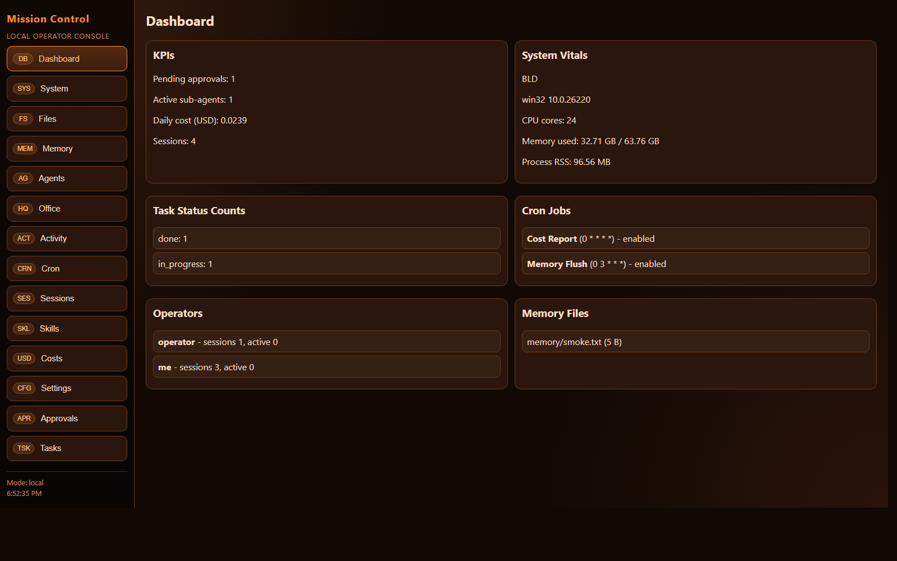
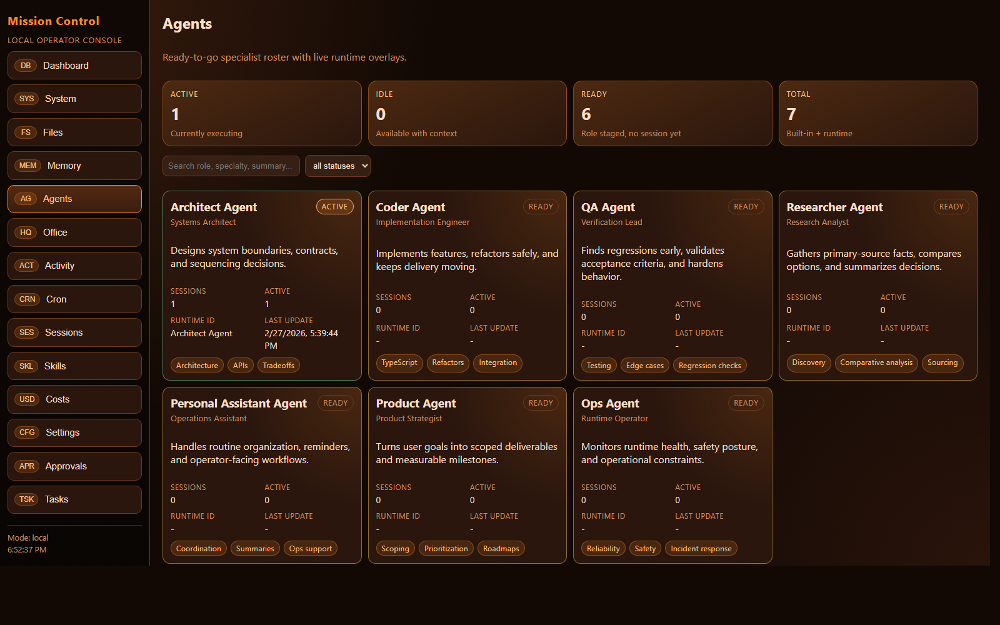
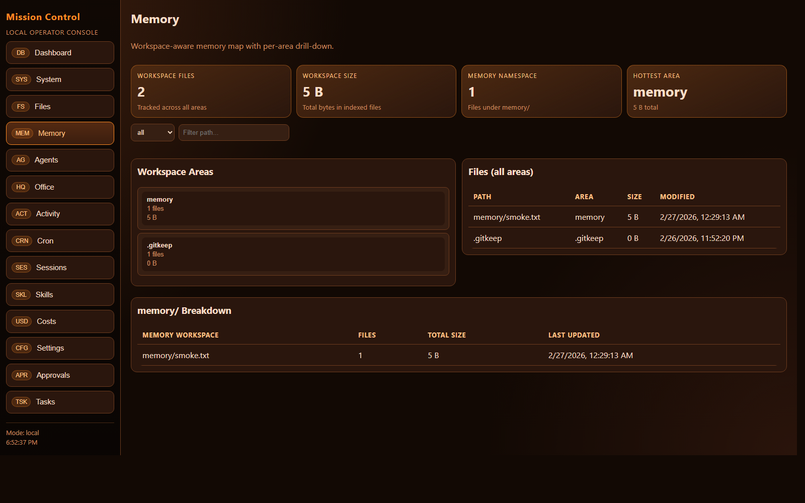
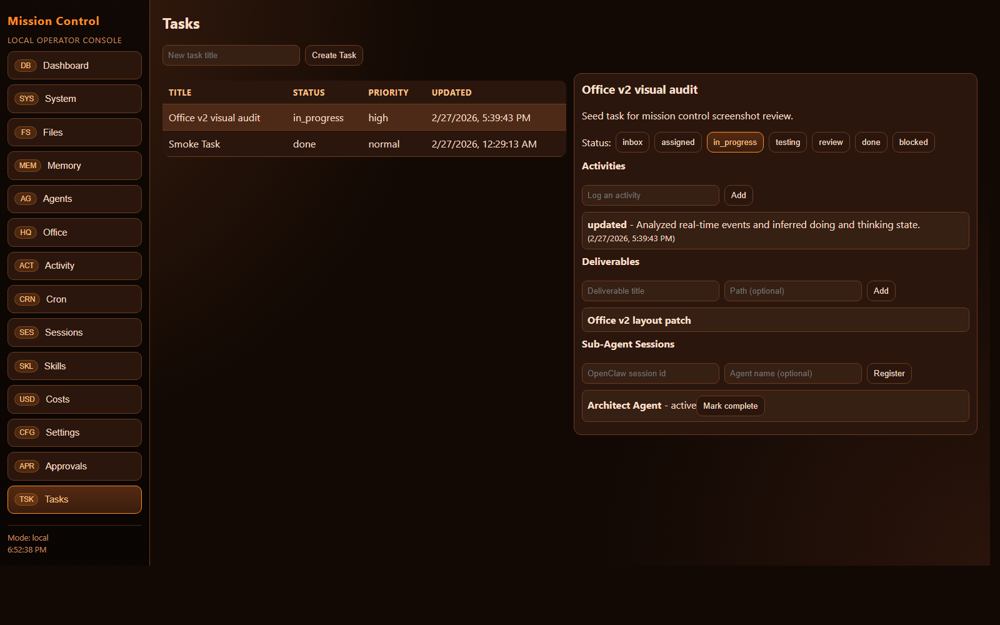
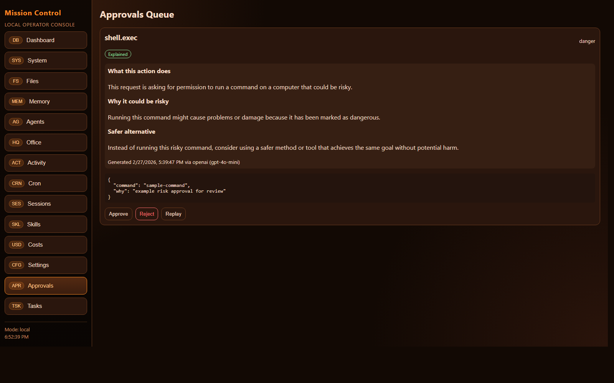
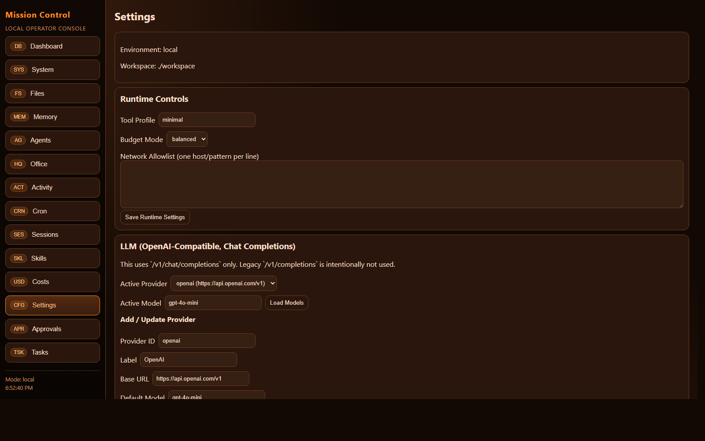

# Personal AI Assistant Mission Control (Local, TypeScript, OpenAI-Compatible)

Local-first personal AI assistant platform with:

- Fastify gateway as source-of-truth for sessions, tokens, and cost
- policy-gated tools (directory jail + network allowlist + approval gates)
- skills system (`SKILL.md` frontmatter)
- Mission Control UI (including a real WebGL Office view)
- orchestration skeleton (plans/waves/phases + checkpoints)

No Docker required.

## Screenshots

### Dashboard


### WebGL Office


### Agent Directory


### Workspace Memory Breakdown


### Tasks


### Approvals Queue


### Settings (OpenAI-Compatible Providers)


You can also open the local gallery page:
`artifacts/screenshots/mission-control/index.html`

## What This Project Does

### 1) Gateway + Session Truth
- Deterministic routing keys for DM/group/thread-style sessions
- Append-only transcript events (`data/transcripts/*.jsonl`)
- SQLite fast index/cache (`data/index.db`)
- Gateway-owned token and cost accounting
- idempotency enforcement for mutating requests

### 2) Tool Policy + Local Sandboxing
- profile/allow/deny policy resolution with deny-wins semantics
- per-agent policy overrides
- write jail path checks
- network allowlist checks
- approval-required flow for risky actions
- replayable audit events

### 3) Skills System
- skill folders with `SKILL.md` + YAML frontmatter
- deterministic load precedence
- activation by explicit mention, keywords, and dependencies

### 4) Mission Control UI
- Dashboard, System, Files, Memory, Agents, Office, Activity, Cron, Sessions, Skills, Costs, Settings, Approvals, Tasks
- API-first behavior (no UI scraping)
- realtime stream via SSE (`/api/v1/events/stream`)
- WebGL Office: interactive 3D desks/avatars with click-to-inspect details

### 5) Orchestration Skeleton
- plans -> waves -> phases model
- checkpoints and run events
- hard-limit hooks and gating points

## Tech Stack

- **Runtime:** Node.js + TypeScript
- **Monorepo:** pnpm workspaces
- **Backend:** Fastify
- **Frontend:** React + Vite
- **3D UI:** Three.js + React Three Fiber + Drei
- **Storage:** `node:sqlite` + append-only JSONL logs

## Repository Layout

```text
apps/
  gateway/          # API server (session truth, policy, approvals, orchestration)
  mission-control/  # React UI
packages/
  contracts/        # shared types/contracts
  storage/          # sqlite + jsonl repositories
  gateway-core/     # event ingest/session key/token ledger logic
  policy-engine/    # tool policy + sandbox enforcement
  skills/           # skill loader/resolver
  orchestration/    # plan/run/checkpoint engine skeleton
config/             # assistant/policy/budget/provider configs
data/               # sqlite db + transcript and audit logs
skills/             # bundled/workspace skills
workspace/          # primary write-jail workspace
```

## Prerequisites

- Node.js 22+ (recommended)
- pnpm 10+
- Git (required for worktree/orchestration workflows)
- Windows, macOS, or Linux (this project has been actively tested on Windows)

## Installation

```bash
pnpm install
```

## First Run (Local)

### 1) Start gateway
```bash
pnpm dev:gateway
```
Gateway listens on:
`http://127.0.0.1:8787`

Health check:
`GET http://127.0.0.1:8787/health`

### 2) Start Mission Control UI
```bash
pnpm dev:ui
```
UI listens on:
`http://127.0.0.1:5173`

### 3) Open the app
Go to:
`http://127.0.0.1:5173`

## Configuration

Core config files:

- `config/assistant.config.json`
- `config/tool-policy.json`
- `config/budgets.json`
- `config/llm-providers.json`

Environment template:

- `.env.example`

### OpenAI-Compatible Provider Setup

The project uses **chat/completions** only (no legacy completions path).

Default providers include:
- OpenAI (`https://api.openai.com/v1`)
- LM Studio (`http://127.0.0.1:1234/v1`)

You can:
- configure providers in `config/llm-providers.json`, or
- use the **Settings** tab in Mission Control to add/update providers

Supported model routing endpoint:
- `POST /api/v1/llm/chat-completions`

## Security Model

- strict idempotency requirement on mutating API requests (`Idempotency-Key`)
- policy engine enforces tool profile + allow + deny (deny wins)
- directory jail and read-only roots for local file constraints
- network allowlist for outbound calls
- approval queue for risky actions (HITL)
- append-only audit trails for tool/policy/approval events

## Data and Persistence

- SQLite index/cache: `data/index.db`
- session transcript truth: `data/transcripts/<sessionId>.jsonl`
- audit streams: `data/audit/*.jsonl`

Important: transcripts and audit files are append-only event streams.

## Typical Operator Workflow

1. Open **Dashboard** for health/KPI overview
2. Open **Settings** and verify active LLM provider/model
3. Use **Tasks** to create and track work
4. Monitor **Office** (WebGL) for live agent state/thoughts
5. Resolve blocked/risky actions in **Approvals**
6. Track usage in **Costs** and **Sessions**
7. Inspect artifacts in **Files** and **Memory**

## Scripts

Root:

- `pnpm dev` - run gateway + mission control together
- `pnpm dev:gateway`
- `pnpm dev:ui`
- `pnpm build`
- `pnpm typecheck`
- `pnpm test`
- `pnpm lint`

## API Surface (High-Level)

### Core
- `POST /api/v1/gateway/events`
- `GET /api/v1/sessions`
- `POST /api/v1/tools/invoke`

### Approvals
- `POST /api/v1/approvals`
- `GET /api/v1/approvals`
- `POST /api/v1/approvals/:approvalId/resolve`
- `GET /api/v1/approvals/:approvalId/replay`

### Costs
- `GET /api/v1/costs/summary`
- `POST /api/v1/costs/run-cheaper`

### Tasks
- `GET/POST /api/v1/tasks`
- `PATCH/DELETE /api/v1/tasks/:taskId`
- activity, deliverable, subagent sub-routes

### Realtime + Dashboard
- `GET /api/v1/events`
- `GET /api/v1/events/stream`
- `GET /api/v1/dashboard/state`
- `GET /api/v1/system/vitals`

### LLM
- `GET /api/v1/llm/providers`
- `GET/PATCH /api/v1/llm/config`
- `GET /api/v1/llm/models`
- `POST /api/v1/llm/chat-completions`

### Skills
- `GET /api/v1/skills`
- `POST /api/v1/skills/reload`
- `POST /api/v1/skills/resolve-activation`

### Orchestration
- `POST /api/v1/orchestration/plans`
- `POST /api/v1/orchestration/plans/:planId/run`
- `POST /api/v1/orchestration/phases/:phaseId/approve`
- `GET /api/v1/orchestration/runs/:runId`

## Troubleshooting

### UI cannot reach gateway
- Ensure gateway is running on `127.0.0.1:8787`
- Set `VITE_GATEWAY_URL` if you run gateway on a different host/port

### Requests fail with idempotency errors
- Mutating routes require `Idempotency-Key`
- Mission Control client auto-generates this header

### LLM models not loading
- verify provider `baseUrl` and API key/env
- check provider compatibility with OpenAI `/v1/chat/completions` and `/v1/models`

### Tool blocked unexpectedly
- inspect `config/tool-policy.json`
- review `networkAllowlist`, jail roots, and deny rules
- inspect Approvals and audit logs

## GitHub: Create and Push a New Repo

From this project root:

```bash
git init
git add .
git commit -m "feat: initial local-first personal AI assistant platform"
```

Create a repo on GitHub, then:

```bash
git remote add origin https://github.com/<your-user>/<your-repo>.git
git branch -M main
git push -u origin main
```

## License

No license file is currently included.
Add one (MIT/Apache-2.0/etc.) before publishing publicly.
